# Understanding the Codebase

## Resources
- [mermaid.live for rendering visual diagrams](https://www.mermaid.live)
- [mermaid docs](https://mermaid.js.org/intro/)

### 🤖 Prompting with Copilot
- 🗣️ "can you generate me a **mermaid sequence diagram** that could provide me with a high-level understanding of $X$"
	- let $X$ be your particular project
	- 💡 [#Example High level Understanding of Codebase for Excalidraw](#Example%20High%20level%20Understanding%20of%20Codebase%20for%20Excalidraw)
- ➡️ navigate to your where your dependencies are tracked first:
- 🗣️ "can you generate me a **markdown table** of all the relevant dependencies ordered by dependency descending, with headings of: package,  description, and ranking limit of 5"
	- 💡 [#Example Markdown Table of Dependencies for Excalidraw](#Example%20Markdown%20Table%20of%20Dependencies%20for%20Excalidraw)
- ➡️ navigate to file of relevance to your issue:
- 🗣️ "can you generate me a mermaid flowchart when $X$ does $Y$"
	- let $X$ be an actor, i.e.: user, component of the program etc.
	- let $Y$ be particular action of interest, related to your issue.
	- 💡 [#Example Generating Flowchart for Unique Cases relevant to your Issue](#Example%20Generating%20Flowchart%20for%20Unique%20Cases%20relevant%20to%20your%20Issue) 

---

# Examples of using Copilot to generate Diagrams

## Example: High level Understanding of Codebase for Excalidraw

```mermaid
sequenceDiagram

participant User

participant UI as UI Layer

participant App as App.tsx

participant Scene as Scene Manager

participant Actions as Action System

participant Elements as Element System

participant Renderer as Canvas Renderer

participant Storage as Storage/Sync

  

Note over User, Storage: Excalidraw High-Level Architecture & User Flows

  

%% Application Initialization

User->>UI: Open Excalidraw

UI->>App: Initialize React App

App->>Scene: Create Scene Manager

App->>Actions: Register Actions

App->>Renderer: Initialize Canvas

App->>Storage: Load saved data

Storage-->>App: Return elements/state

App->>Scene: Populate elements

Scene->>Renderer: Render initial canvas

  

%% Drawing Flow

Note over User, Renderer: Drawing Elements

User->>UI: Select tool (rectangle, arrow, etc.)

UI->>App: Update activeTool state

User->>UI: Click/drag on canvas

UI->>App: onPointerDown event

App->>Elements: Create new element

Elements-->>App: Return element data

App->>Scene: Add element to scene

Scene->>Renderer: Re-render canvas

%% Selection & Manipulation

Note over User, Renderer: Element Selection & Editing

User->>UI: Click element

UI->>App: onPointerDown with hit detection

App->>Scene: getElementAtPosition()

Scene-->>App: Return hit element

App->>App: Update selectedElementIds

App->>Renderer: Render selection outline

User->>UI: Drag element

UI->>App: onPointerMove events

App->>Elements: Transform element coordinates

App->>Scene: Update element in scene

Scene->>Renderer: Re-render with new positions

  

%% Group Operations

Note over User, Renderer: Group Management

User->>UI: Select multiple elements + Group action

UI->>Actions: Execute actionGroup

Actions->>Elements: Add groupIds to elements

Actions->>Scene: Update elements

Scene->>Renderer: Render group selection

  

User->>UI: Double-click group

UI->>App: handleCanvasDoubleClick

App->>Elements: Enter group editing mode

App->>App: Set editingGroupId

App->>Renderer: Render group editing state

  

%% Align/Distribute Actions

Note over User, Actions: Align & Distribute

User->>UI: Click align/distribute button

UI->>Actions: Execute align/distribute action

Actions->>Elements: Calculate new positions

Actions->>Elements: Apply transformations

Actions->>Scene: Batch update elements

Scene->>Renderer: Re-render aligned elements

  

%% Text Editing

Note over User, Renderer: Text Elements

User->>UI: Select text tool + click

UI->>App: startTextEditing()

App->>Elements: Create text element

App->>UI: Show text editor

User->>UI: Type text

UI->>Elements: Update text content

Elements->>Scene: Update text element

Scene->>Renderer: Re-render text

  

%% Real-time Collaboration

Note over User, Storage: Collaboration (if enabled)

User->>App: Make changes

App->>Storage: Send changes via WebSocket

Storage->>Storage: Sync with other clients

Storage-->>App: Broadcast updates

App->>Scene: Apply remote changes

Scene->>Renderer: Render collaborative cursors

  

%% Export & Save

Note over User, Storage: Export & Persistence

User->>UI: Export action

UI->>Actions: Execute export action

Actions->>Scene: Get all elements

Actions->>Renderer: Generate export data

Renderer-->>UI: Return image/JSON

UI-->>User: Download file

  

User->>UI: Auto-save trigger

UI->>App: Save state

App->>Storage: Persist to localStorage

Storage-->>App: Confirm save

  

%% Undo/Redo System

Note over User, App: History Management

User->>UI: Undo/Redo action

UI->>Actions: Execute history action

Actions->>App: Restore previous state

App->>Scene: Replace all elements

Scene->>Renderer: Re-render from history

  

Note over User, Storage: Key Architecture Principles

Note over User, Storage: • Immutable state management

Note over User, Storage: • Event-driven architecture

Note over User, Storage: • Separation of concerns

Note over User, Storage: • Canvas-based rendering

Note over User, Storage: • Action-based interactions
```

## Example: Markdown Table of Dependencies for Excalidraw

|Package|Description|Ranking|
|---|---|---|
|react|Core React library - the foundational framework for Excalidraw's UI components and state management|1|
|react-dom|React DOM renderer - enables React components to render to the browser DOM, essential for the canvas and UI|2|
|firebase|Backend-as-a-Service platform - provides real-time collaboration, authentication, and data persistence features|3|
|socket.io-client|Real-time WebSocket client - enables live collaboration features like shared cursors and synchronized drawing|4|
|jotai|Atomic state management library - manages React state in a more granular and performant way than traditional Redux|5|

## Example: Generating Flowchart for Unique Cases relevant to your Issue

