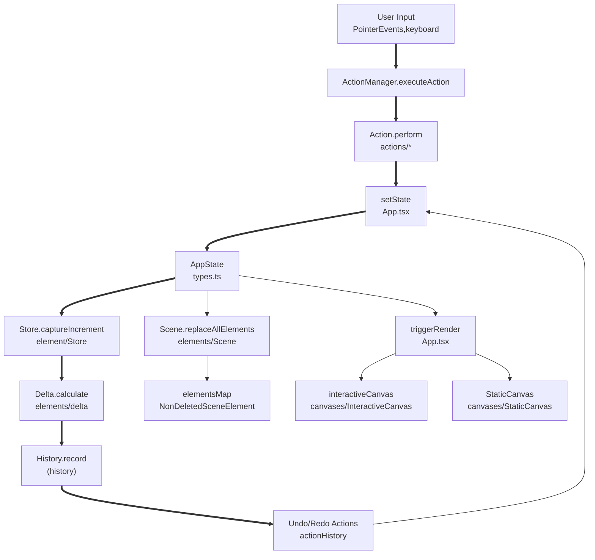
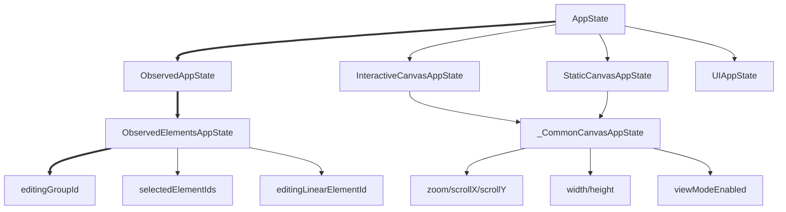
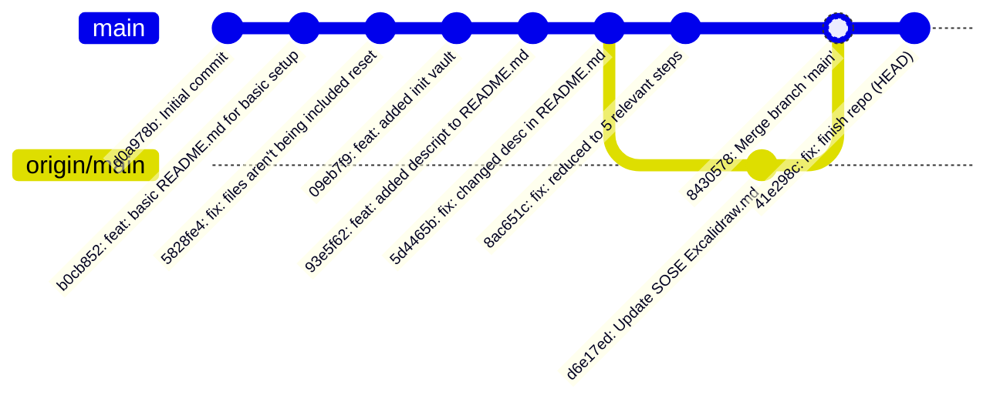

---
tags:
  - cs
  - csonline
  - csumb
  - excalidraw
  - app
  - programming
  - development
---
# Deep Diving Deep Wiki
### Resources
- [f] [DeepWiki Mainpage](https://www.deepwiki.com)
	- [DeepWiki for Excalidraw](https://deepwiki.com/excalidraw/excalidraw)
- [f] [in case your project doesn't have one: easy add example](https://deepwiki.com/OpenEnergyDashboard/OED)
	- possible to create one for the project
	- requires indexing, so will take 2-10 minutes
	- could be a great way of creating rapport with a maintainer?

---
# Some Copy Pasta from DeepWiki
## Web Application
### Application Architecture
- Single Page Application (SPA)
- Progressive Web Application (PWA)

### Common Build Commands

| Script             | Purpose                        | Environment       |
| ------------------ | ------------------------------ | ----------------- |
| `build:app`        | Production build with tracking | Vercel deployment |
| `build:app:docker` | Docker container build         | Self-hosted       |
| `start`            | Development server             | Local development |
| `build:preview`    | Preview build locally          | Testing           |
| `serve`            | Static file serving            | Local testing     |

## Architecture
architecture is composed of 3 key bodies
- Canvas System
- **Core Services**
- and State Management

## State Managment Flow
The application uses a centralized state management pattern with `AppState` as the single source of truth. State updates flow through a delta-based system that enables efficient undo/redo operations and collaborative features.

### Action System and Command Pattern(get mermaid later)

![[Screenshot 2025-07-02 at 3.28.30 PM.png]]

## App Component Architecture
|Service|Type|Purpose|
|---|---|---|
|`scene`|`Scene`|Element storage and management|
|`renderer`|`Renderer`|Static canvas rendering pipeline|
|`actionManager`|`ActionManager`|Command pattern implementation|
|`history`|`History`|Undo/redo functionality|
|`store`|`Store`|State change detection and recording|
|`library`|`Library`|Shape library management|
|`fonts`|`Fonts`|Font loading and metrics|

### Core Services Architecture
**Scene Management**

The `Scene` class manages the collection of drawing elements and provides methods for querying and updating them.

**Renderer System**

The `Renderer` class handles the static canvas rendering pipeline, converting elements into visual representations.

**Action Management**

The `ActionManager` implements a command pattern for all user actions, enabling undo/redo functionality and consistent state updates.

**History and Store**

The `History` class works with the `Store` to track state changes using a delta-based system for efficient undo/redo operations.

### Canvas Responsibilities
| Component           | Purpose                                 | Canvas Type         |
| ------------------- | --------------------------------------- | ------------------- |
| `StaticCanvas`      | Renders finalized elements              | `HTMLCanvasElement` |
| `InteractiveCanvas` | Handles user interactions, selection UI | `HTMLCanvasElement` |
| `NewElementCanvas`  | Previews elements being created         | `HTMLCanvasElement` |
| `SVGLayer`          | Renders UI overlays and highlights      | `SVGElement`        |

## State Management
States I should be interested in `editingGroupId` and `selectedElementIds`
### State Hierarchy related to the issue

---
# Repository Git Graph

### Git History Summary
- **Total Commits**: 9
- **Branches**: main, origin/main
- **Notable Events**:
  - Repository initialized on 2025-07-11
  - Merge conflict resolved at commit `8430578`
  - Current HEAD at `41e298c` on main branch
  - Remote tracking branch: `origin/main`

---

