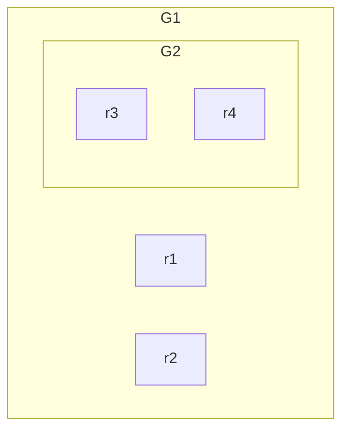

# Group Methods
## Resources
- [Markdown syntax](https://help.obsidian.md/syntax)
### 🤖 Prompting with Copilot
- [>] Go to file relevant to your issue.
- ["] "Could you generate a **markdown table** of all the methods in file $X$ with Headings consisting of: Method, Parameters, Return Type and Description"
	- let $X$ be the the relevant file to your issue

---
# Debug Session: Example for `../groups.ts`

| Method                            | Parameters                                                                                                                                                                                                   | Return Type                                                                                       | Description                                                                                                               |
| --------------------------------- | ------------------------------------------------------------------------------------------------------------------------------------------------------------------------------------------------------------ | ------------------------------------------------------------------------------------------------- | ------------------------------------------------------------------------------------------------------------------------- |
| `selectGroup`                     | `groupId: GroupId`<br>`appState: InteractiveCanvasAppState`<br>`elements: readonly NonDeleted<ExcalidrawElement>[]`                                                                                          | `Pick<InteractiveCanvasAppState, "selectedGroupIds" \| "selectedElementIds" \| "editingGroupId">` | Selects a group and updates the app state accordingly. If the group has fewer than 2 elements, it may deselect the group. |
| `selectGroupsForSelectedElements` | `appState: Pick<AppState, "selectedElementIds" \| "editingGroupId">`<br>`elements: readonly NonDeletedExcalidrawElement[]`<br>`prevAppState: InteractiveCanvasAppState`<br>`app: AppClassProperties \| null` | `Pick<InteractiveCanvasAppState, "selectedGroupIds" \| "editingGroupId" \| "selectedElementIds">` | Selects groups for currently selected elements. Uses caching for performance.                                             |
| `isSelectedViaGroup`              | `appState: InteractiveCanvasAppState`<br>`element: ExcalidrawElement`                                                                                                                                        | `boolean`                                                                                         | Checks if an element is selected through its group selection rather than directly.                                        |
| `getSelectedGroupForElement`      | `appState: Pick<InteractiveCanvasAppState, "editingGroupId" \| "selectedGroupIds">`<br>`element: ExcalidrawElement`                                                                                          | `string \| undefined`                                                                             | Returns the selected group ID for a given element.                                                                        |
| `getSelectedGroupIds`             | `appState: InteractiveCanvasAppState`                                                                                                                                                                        | `GroupId[]`                                                                                       | Returns an array of all currently selected group IDs.                                                                     |
| `selectGroupsFromGivenElements`   | `elements: readonly NonDeleted<ExcalidrawElement>[]`<br>`appState: InteractiveCanvasAppState`                                                                                                                | `Record<string, boolean>`                                                                         | Returns group IDs that should be selected based on given elements.                                                        |
| `editGroupForSelectedElement`     | `appState: AppState`<br>`element: NonDeleted<ExcalidrawElement>`                                                                                                                                             | `AppState`                                                                                        | Puts a group into editing mode for a selected element.                                                                    |
| `isElementInGroup`                | `element: ExcalidrawElement`<br>`groupId: string`                                                                                                                                                            | `boolean`                                                                                         | Checks if an element belongs to a specific group.                                                                         |
| `getElementsInGroup`              | `elements: ElementsMapOrArray`<br>`groupId: string`                                                                                                                                                          | `ExcalidrawElement[]`                                                                             | Returns all elements that belong to a specific group.                                                                     |
| `getSelectedGroupIdForElement`    | `element: ExcalidrawElement`<br>`selectedGroupIds: { [groupId: string]: boolean }`                                                                                                                           | `string \| undefined`                                                                             | Returns the first selected group ID that the element belongs to.                                                          |
| `addToGroup`                      | `prevGroupIds: ExcalidrawElement["groupIds"]`<br>`newGroupId: GroupId`<br>`editingGroupId: AppState["editingGroupId"]`                                                                                       | `GroupId[]`                                                                                       | Adds an element to a group, considering the current editing group.                                                        |
| `removeFromSelectedGroups`        | `groupIds: ExcalidrawElement["groupIds"]`<br>`selectedGroupIds: { [groupId: string]: boolean }`                                                                                                              | `GroupId[]`                                                                                       | Removes element from all selected groups.                                                                                 |
| `getMaximumGroups`                | `elements: ExcalidrawElement[]`<br>`elementsMap: ElementsMap`                                                                                                                                                | `ExcalidrawElement[][]`                                                                           | Returns arrays of elements grouped by their outermost group.                                                              |
| `getNonDeletedGroupIds`           | `elements: ElementsMap`                                                                                                                                                                                      | `Set<string>`                                                                                     | Returns a set of group IDs that have at least one non-deleted element.                                                    |
| `elementsAreInSameGroup`          | `elements: readonly ExcalidrawElement[]`                                                                                                                                                                     | `boolean`                                                                                         | Checks if all provided elements belong to the same group.                                                                 |
| `isInGroup`                       | `element: NonDeletedExcalidrawElement`                                                                                                                                                                       | `boolean`                                                                                         | Checks if an element belongs to any group.                                                                                |
| `getNewGroupIdsForDuplication`    | `groupIds: ExcalidrawElement["groupIds"]`<br>`editingGroupId: AppState["editingGroupId"]`<br>`mapper: (groupId: GroupId) => GroupId`                                                                         | `GroupId[]`                                                                                       | Creates new group IDs when duplicating elements, using a mapping function.                                                |

ones of interest:
- `getSelectedGroupIds`
- `getSelectedGroupIdForElement`

---
## Initial Case Step through Process



- r1 has groupId -> [G1]
- r2 has groupId -> [G1]
- r3 has groupId -> [G1,G2]
- r4 has groupId -> [G1,G2]

- [b] behavior in app state reflects changes made when entering editing mode of a group
	- `appState.selectedGroupIds` excludes the `editingGroupid` within it's set
	- `appState.selectedElements` selects all elements in a even when bound by a group
	- so if we are editing G1 and select r1, r2 and G2
		- `appState.selectedGroupIds = {G2}`
		- `appState.selectedElementIds = { r1:true, r2:true, r3:true, r4:true }`
- [b] the topmost group is always the last in the array

## adding an additional feature to Pull Request stepping through process


# Modifications to Source Code
## Changes in `./groups.ts`

```ts title:"proposed method for ../groups.ts" diff_plus:3-20
// line 406
// if element is not in a group will be casted as a 1D array
export const getSelectedElementsByGroup(
	selectedElements: ExcalidrawElement[],
	appState: Readonly<AppState>,
): ExcalidrawElement[][] => {
	const selectedGroupIds = getSelectedGroupIds(appState);
    const selectedElementsInGroups = selectedGroupIds.map((groupId) =>
        getElementsInGroup(selectedElements, groupId),
    );
    const elementSet = new Set<ExcalidrawElement>(
        selectedElementsInGroups.flatMap((elements) => elements),
    );
    const selectedElementsNoGroups = selectedElements
        .filter((element) => !elementSet.has(element))
        .map((element) => [element]);
    return [
    ...selectedElementsInGroups,
    ...selectedElementsNoGroups,
  ];
}
```

## Changes in `./align.ts`

```ts title:"..element/src/align.ts" diff_plus:1,7, diff_minus:10-13
import { getSelectedElementsByGroup } from "./groups";
// lines 15-47
export const alignElements = (
  selectedElements: ExcalidrawElement[],
  alignment: Alignment,
  scene: Scene,
  appScene: Readonly<AppScene>,
): ExcalidrawElement[] => {
  const elementsMap = scene.getNonDeletedElementsMap();
  const groups: ExcalidrawElement[][] = getMaximumGroups(
    selectedElements,
    elementsMap,
  );
  const selectionBoundingBox = getCommonBoundingBox(selectedElements);

  return groups.flatMap((group) => {
    const translation = calculateTranslation(
      group,
      selectionBoundingBox,
      alignment,
    );
    return group.map((element) => {
      // update element
      const updatedEle = scene.mutateElement(element, {
        x: element.x + translation.x,
        y: element.y + translation.y,
      });

      // update bound elements
      updateBoundElements(element, scene, {
        simultaneouslyUpdated: group,
      });
      return updatedEle;
    });
  });
};

```

## Changes in `../alignAction.tsx`
```ts title:"./actions/actionAlign.tsx" diff_plus:1,10 diff_minus:9 diff_mod:24
import { getSelectedElementsByGroup } from "./groups";

export const alignActionsPredicate = (
  appState: UIAppState,
  app: AppClassProperties,
) => {
  const selectedElements = app.scene.getSelectedElements(appState);
  return (
    selectedElements.length > 1 &&
    getSelectedElementsByGroup(selectedElements, appState as Readonly<AppState>)
    // TODO enable aligning frames when implemented properly
    !selectedElements.some((el) => isFrameLikeElement(el))
  );
};

const alignSelectedElements = (
  elements: readonly ExcalidrawElement[],
  appState: Readonly<AppState>,
  app: AppClassProperties,
  alignment: Alignment,
) => {
  const selectedElements = app.scene.getSelectedElements(appState);

  const updatedElements = alignElements(selectedElements, alignment, app.scene, appState);

  const updatedElementsMap = arrayToMap(updatedElements);

  return updateFrameMembershipOfSelectedElements(
    elements.map((element) => updatedElementsMap.get(element.id) || element),
    appState,
    app,
  );
};
```


## Changes in `../distribute.ts`

```ts title:"..element/src/distribute.ts" diff_plus:3,10,19 diff_minus:2,18 diff_mod:
// line 4
import { getMaximumGroups } from "./groups";
import { getSelectedElementsByGroup } from "./groups";

// line 13-
export const distributeElements = (
  selectedElements: ExcalidrawElement[],
  elementsMap: ElementsMap,
  distribution: Distribution,
  appState: Readonly<AppState>
): ExcalidrawElement[] => {
  const [start, mid, end, extent] =
    distribution.axis === "x"
      ? (["minX", "midX", "maxX", "width"] as const)
      : (["minY", "midY", "maxY", "height"] as const);

  const bounds = getCommonBoundingBox(selectedElements);
  const groups = getMaximumGroups(selectedElements, elementsMap)
  const groups = getSelectedElementsByGroup(selectedElements, appState)
    .map((group) => [group, getCommonBoundingBox(group)] as const)
    .sort((a, b) => a[1][mid] - b[1][mid]);

  let span = 0;
  for (const group of groups) {
    span += group[1][extent];
  }

  const step = (bounds[extent] - span) / (groups.length - 1);

  if (step < 0) {
    // If we have a negative step, we'll need to distribute from centers
    // rather than from gaps. Buckle up, this is a weird one.

    // Get indices of boxes that define start and end of our bounding box
    const index0 = groups.findIndex((g) => g[1][start] === bounds[start]);
    const index1 = groups.findIndex((g) => g[1][end] === bounds[end]);

    // Get our step, based on the distance between the center points of our
    // start and end boxes
    const step =
      (groups[index1][1][mid] - groups[index0][1][mid]) / (groups.length - 1);

    let pos = groups[index0][1][mid];

    return groups.flatMap(([group, box], index) => {
      const translation = {
        x: 0,
        y: 0,
      };

      // Don't move our start and end boxes
      if (index !== index0 && index !== index1) {
        pos += step;
        translation[distribution.axis] = pos - box[mid];
      }

      return group.map((element) =>
        newElementWith(element, {
          x: element.x + translation.x,
          y: element.y + translation.y,
        }),
      );
    });
  }

  // Distribute from gaps

  let pos = bounds[start];

  return groups.flatMap(([group, box]) => {
    const translation = {
      x: 0,
      y: 0,
    };

    translation[distribution.axis] = pos - box[start];

    pos += step;
    pos += box[extent];

    return group.map((element) =>
      newElementWith(element, {
        x: element.x + translation.x,
        y: element.y + translation.y,
      }),
    );
  });
};
```

## Changes in `../distributeAction.tsx`
```ts title:"action/actionDistribute.tsx diff_plus:5,23 diff_minus:4 diff_mod:
const enableActionGroup = (appState: AppState, app: AppClassProperties) => {
  const selectedElements = app.scene.getSelectedElements(appState);
  return (
    selectedElements.length > 1 &&
    getSelectedElementsByGroup(selectedElements, appState as ReadOnly<AppState>) &&
    // TODO enable distributing frames when implemented properly
    !selectedElements.some((el) => isFrameLikeElement(el))
  );
};

const distributeSelectedElements = (
  elements: readonly ExcalidrawElement[],
  appState: Readonly<AppState>,
  app: AppClassProperties,
  distribution: Distribution,
) => {
  const selectedElements = app.scene.getSelectedElements(appState);

  const updatedElements = distributeElements(
    selectedElements,
    app.scene.getNonDeletedElementsMap(),
    distribution,
    appState,
  );
// continued...
}
```

## Tests in `./tests/align.test.tsx`
```ts
// Example
	const createAndSelectGroupAndRectangle = () => {
	    UI.clickTool("rectangle");
	    mouse.down();
	    mouse.up(100, 100);
	
	    UI.clickTool("rectangle");
	    mouse.down(0, 0);
	    mouse.up(100, 100);
	
	    // Select the first element.
	    // The second rectangle is already reselected because it was the last element created
	    mouse.reset();
	    Keyboard.withModifierKeys({ shift: true }, () => {
	      mouse.moveTo(10, 0);
	      mouse.click();
	    });
	
	    API.executeAction(actionGroup);
	
	    mouse.reset();
	    UI.clickTool("rectangle");
	    mouse.down(200, 200);
	    mouse.up(100, 100);
	
	    // Add the created group to the current selection
	    mouse.restorePosition(0, 0);
	    Keyboard.withModifierKeys({ shift: true }, () => {
	      mouse.moveTo(10, 0);
	      mouse.click();
	    });
	  };
	
	  it("aligns a group with another element correctly to the top", () => {
	    createAndSelectGroupAndRectangle();
	
	    expect(API.getSelectedElements()[0].y).toEqual(0);
	    expect(API.getSelectedElements()[1].y).toEqual(100);
	    expect(API.getSelectedElements()[2].y).toEqual(200);
	
	    API.executeAction(actionAlignTop);
	
	    expect(API.getSelectedElements()[0].y).toEqual(0);
	    expect(API.getSelectedElements()[1].y).toEqual(100);
	    expect(API.getSelectedElements()[2].y).toEqual(0);
	  });
	
	  it("aligns a group with another element correctly to the bottom", () => {
	    createAndSelectGroupAndRectangle();
	
	    expect(API.getSelectedElements()[0].y).toEqual(0);
	    expect(API.getSelectedElements()[1].y).toEqual(100);
	    expect(API.getSelectedElements()[2].y).toEqual(200);
	
	    API.executeAction(actionAlignBottom);
	
	    expect(API.getSelectedElements()[0].y).toEqual(100);
	    expect(API.getSelectedElements()[1].y).toEqual(200);
	    expect(API.getSelectedElements()[2].y).toEqual(200);
	  });
	
	  it("aligns a group with another element correctly to the left", () => {
	    createAndSelectGroupAndRectangle();
	
	    expect(API.getSelectedElements()[0].x).toEqual(0);
	    expect(API.getSelectedElements()[1].x).toEqual(100);
	    expect(API.getSelectedElements()[2].x).toEqual(200);
	
	    API.executeAction(actionAlignLeft);
	
	    expect(API.getSelectedElements()[0].x).toEqual(0);
	    expect(API.getSelectedElements()[1].x).toEqual(100);
	    expect(API.getSelectedElements()[2].x).toEqual(0);
	  });
	
	  it("aligns a group with another element correctly to the right", () => {
	    createAndSelectGroupAndRectangle();
	
	    expect(API.getSelectedElements()[0].x).toEqual(0);
	    expect(API.getSelectedElements()[1].x).toEqual(100);
	    expect(API.getSelectedElements()[2].x).toEqual(200);
	
	    API.executeAction(actionAlignRight);
	
	    expect(API.getSelectedElements()[0].x).toEqual(100);
	    expect(API.getSelectedElements()[1].x).toEqual(200);
	    expect(API.getSelectedElements()[2].x).toEqual(200);
	  });
	
	  it("centers a group with another element correctly vertically", () => {
	    createAndSelectGroupAndRectangle();
	
	    expect(API.getSelectedElements()[0].y).toEqual(0);
	    expect(API.getSelectedElements()[1].y).toEqual(100);
	    expect(API.getSelectedElements()[2].y).toEqual(200);
	
	    API.executeAction(actionAlignVerticallyCentered);
	
	    expect(API.getSelectedElements()[0].y).toEqual(50);
	    expect(API.getSelectedElements()[1].y).toEqual(150);
	    expect(API.getSelectedElements()[2].y).toEqual(100);
	  });
	
	  it("centers a group with another element correctly horizontally", () => {
	    createAndSelectGroupAndRectangle();
	
	    expect(API.getSelectedElements()[0].x).toEqual(0);
	    expect(API.getSelectedElements()[1].x).toEqual(100);
	    expect(API.getSelectedElements()[2].x).toEqual(200);
	
	    API.executeAction(actionAlignHorizontallyCentered);
	
	    expect(API.getSelectedElements()[0].x).toEqual(50);
	    expect(API.getSelectedElements()[1].x).toEqual(150);
	    expect(API.getSelectedElements()[2].x).toEqual(100);
	  });
```


