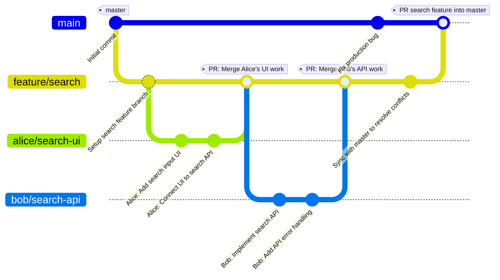

---
tags:
  - cs
  - csonline
  - csumb
  - cti
  - accelerate
  - codeday
---
# SOSE Excalidraw
## Important Links
- [Excalidraw Github](https://github.com/excalidraw/excalidraw)
	- [Contributing Guide](https://docs.excalidraw.com/docs/introduction/contributing)
	- [Development Docs](https://docs.excalidraw.com/docs/introduction/development)
	- [API Docs](https://docs.excalidraw.com/docs/@excalidraw/excalidraw/api)
	- ==[DeepWiki](https://deepwiki.com/excalidraw/excalidraw)==
- [SOSE 2025 Teams](https://docs.google.com/spreadsheets/d/1goZeptpZLQppcT_1bMV_vXQLpr05jlj02S1Kl8ifGpQ/edit?gid=0#gid=0)
- [[Finding Case Studies–Use This]]

### Milestones
- [x]  [Issue Selected(Aligning elements in the group #9606)](https://github.com/excalidraw/excalidraw/issues/9606)
- [ ] [Pull Request(Fix: aligning and distributing elements and nested groups while editing a group #9721)](https://github.com/excalidraw/excalidraw/pull/9721)
- [ ] [[10 Issue Found - Discovery Phase|Issue to be raised in relation to groups]]
 
### External Resources
- [React Docs](https://react.dev)
- [Scrimba React Course](https://scrimba.com/)
## Team
- Mentor: Swapna Nadakuditi
- Chris Tangonan
- Kaulan Serzhanuly
## Table of Contents for Vault
- [[01 Understanding the Codebase]]
- [[02 Architecture Deep Diving DeepWiki]]
- [[03 Case Studies-Grouping and Align]]
- [[04 Group debug session]]


---
# Build Instructions
## Steps to get it running locally
1. fork repository
2. `git checkout -b <new_test_branch_name>`
3. bash command: `yarn` to install dependencies
	1. note: `node` version current for build is between 18-22, [#]
		- I have the latest npm installed, So i had to use `nvm`
			- if you don't have `nvm` installed, [link to nvm repo](https://github.com/nvm-sh/nvm)

### in case you have the latest `npm` 
use `nvm` in order to downgrade your node version
- if you don't have `nvm` installed: 
	- [link to repo](https://github.com/nvm-sh/nvm)
- ==note:== `nvm-windows` for PC 🖥️
	- [link to repo](https://github.com/coreybutler/nvm-windows)
after running the curl or wGet command for installation, open new terminal
- downgrade your node version
```bash
nvm install 22
nvm use 22 # using the latest version possible

node -v # check to ensure your node version has changed
```
*after this step you should be able to run the `yarn` command without issue*

### In order to serve and see what the application looks like
```bash
yarn build:preview
```

![[02 Architecture Deep Diving DeepWiki#Common Build Commands]]

---
## Git Workflow
### Pre-Commit
```bash
# testing and lint
yarn test:typecheck
yarn test:update
yarn test
yarn fix

# git commands
git status
git add <relevant_files>
git commit -m "tag: message"

# for when ready to make pull request
git push origin <relevant_branch>

```





